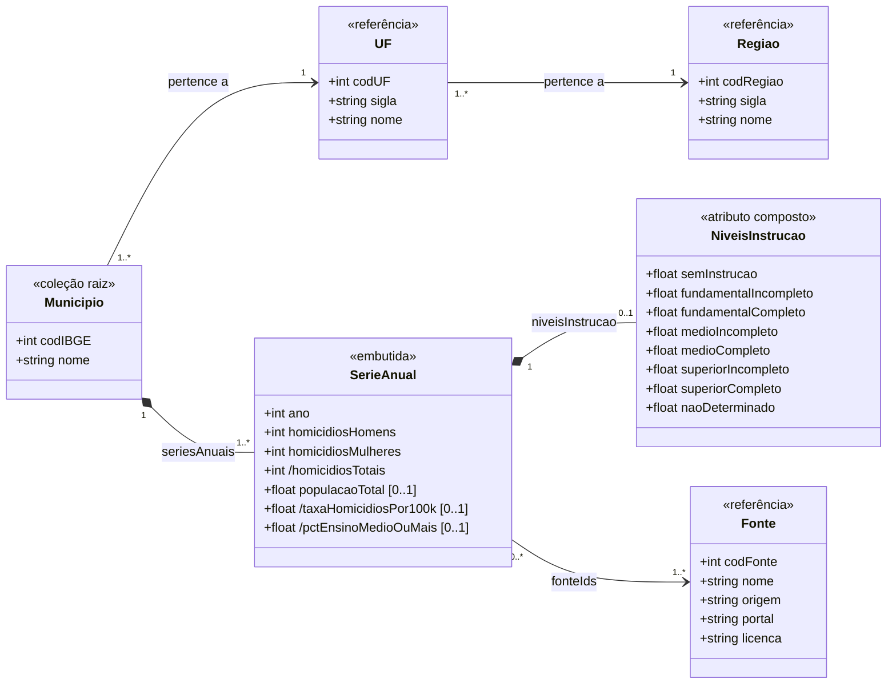

# Projeto da Disciplina – Banco de Dados 2026.1
## Atlas da Violência × Indicadores Socioeconômicos por Município

**Equipe:** Rodrigo de Queiroz Gonçalves Velez · Caio Jordan de Lima Maia · Matheus Moreira Luna </br>
**Disciplina:** Banco de Dados — MPTI / IFPB (Campus João Pessoa) </br>
**Professor:** Diego Pessoa </br>
**Checkpoint:** C1 — Escopo + fonte + dicionário de dados (entrega 08/06/2026) </br>

---

## 2. Escopo (definição do problema)

### 2.a Problema de dados

A literatura em segurança pública sugere associação entre violência letal e fatores socioeconômicos, especialmente escolaridade e condições demográficas. Entretanto, esses dados não convivem no mesmo ecossistema. Eles se encontram **separados**: o mapa da violência está localizado no Atlas da Violência (Ipea/FBSP) e os indicadores socioeducacionais estão no IBGE. Hoje, cruzar "taxa de homicídios" com indicadores de escolaridade de um mesmo município exige fazer download de planilhas distintas, padronizar nomes/códigos de município e conciliar períodos (anos).

A aplicação resolve isso oferecendo uma base **unificada e consultável** que responde, por município, região e ano, a perguntas como *"os municípios mais violentos apresentam menor escolaridade?"* e *"como essa relação evoluiu na última década?"*.

**Usuários-alvo:**
- **Gestor público / formulador de políticas** (ex.: secretarias de segurança e de assistência social) que precisa priorizar territórios.
- **Pesquisador / jornalista de dados** que quer explorar a relação violência × escolaridade sem montar o pipeline do zero.

### 2.b Solução proposta

**Pipeline ETL (organização Medallion):**

```
* Bronze (JSON bruto por fonte/série)

Atlas da Violência (CSV local — Ipea)   ─┐
                                         ├─► [Extração]
IBGE SIDRA Tabela 5919 (CSV local)      ─┤
                                         │
IBGE API Localidades (REST — a coletar) ─┘

* Prata (JSON trabalhado)
                                            ↓
                              [Transformação] limpeza, type casting,
                              padronização do código IBGE do município (chave),
                              alinhamento de anos, cálculo de taxas,
                              agregação trimestral → anual (SIDRA),
                              junção município ↔ UF ↔ região (API Localidades)
                                            ↓
                              [Modelagem em documentos]
                              Município { dados fixos } + SériesAnuais[ { ano, indicadores } ]
                                            ↓
* Gold: carga no MongoDB
                                            ↓
                              Aplicação: mapa coroplético + ranking interativo
```

- **Extração:** leitura dos CSVs do Atlas (homicídios por município/sexo/ano) e do SIDRA (população por nível de instrução, trimestral, por município), além de chamada REST à API de Localidades do IBGE (catálogo de municípios com código, sigla da UF e nome da região), preservando o dado bruto na camada Bronze.
- **Transformação:** padronização da chave (código IBGE de 7 dígitos), conversão de tipos, deduplicação, junção das fontes por (município, ano) e construção dos documentos com array de séries anuais embutido.
- **Carga:** uma coleção `municipios` (uma entrada por município, com array `seriesAnuais`) e coleções de apoio (`regioes`/`ufs` e `fontes`) para exercitar referência + `$lookup`.

**Aplicação final:** dashboard web com:  
(1) **mapa coroplético** do Brasil por taxa de homicídios, com filtro de ano e indicador; 
(2) **ranking interativo** (top-N municípios) que cruza violência e indicador socioeconômico selecionado. Cada pergunta da Seção 4 vira um elemento da interface.

### 2.c Por que documentos/MongoDB (justificativa consciente)

O padrão de acesso dominante é *"pegar tudo de um município de uma vez"*: seus dados fixos mais toda a sua série histórica anual de violência e indicadores socioeconômicos — exatamente o que alimenta o mapa e o ranking. Modelar `Município` como documento com um **array embutido de séries anuais** mantém esses dados lidos-juntos fisicamente juntos, evitando o JOIN por ano que um PostgreSQL exigiria (uma tabela `municipio` + uma tabela `serie_anual` com 5–8 colunas e 1 linha por ano). Como a série por município é **limitada e de crescimento previsível** (cerca de uma entrada por ano, ~3 décadas → bem abaixo do limite de 16 MB do BSON), o embedding é seguro. O schema também tolera bem a **variação de indicadores entre anos/fontes** (campos opcionais ausentes em anos sem coleta), sem migração de esquema. Não é uma defesa absoluta — para análises estatísticas tabulares pesadas o relacional competiria —, mas para o padrão *"documento do município pronto para visualização"* o modelo de documentos serve melhor.

---

## 3. Entendimento da Fonte de Dados

O projeto usa **três fontes públicas e complementares**, unidas pelo **código IBGE do município** (chave de 7 dígitos comum às três). Duas já foram coletadas (arquivos locais); a terceira será consumida via API no pipeline ETL (C3).

### 3.a Fonte

---

#### Fonte 1 — Atlas da Violência / Ipea — *arquivos locais (já coletados)*

| Item | Descrição |
|---|---|
| Tipo | Arquivo CSV (download manual do portal Ipeadata) |
| Arquivos | `Homicídios Homens_municípios.csv` · `Homicídios Mulheres_municípios.csv` |
| Origem dos dados | Sistema de Informações sobre Mortalidade (SIM / Datasus / MS), elaboração Ipea / FBSP |
| Portal de acesso | `https://www.ipea.gov.br/atlasviolencia/` e `http://ipeadata.gov.br` |
| Acesso | Público, anônimo, sem chave de API; download direto dos arquivos |
| Licença / uso | Reprodução permitida **citando a fonte** (Ipea/FBSP); uso comercial proibido. Uso acadêmico não-comercial está coberto. |

Os dois arquivos têm estrutura idêntica: três colunas `Período, Região ID, Valor`, separadas por vírgula. `Período` é uma data ISO 8601 no formato `YYYY-01-15T00:00:00.000Z` (sempre 15 de janeiro; o ano é o dado útil). `Região ID` é o código IBGE de 7 dígitos do município. `Valor` é a contagem absoluta de homicídios no município/ano, desagregada por sexo conforme o arquivo.

---

#### Fonte 2 — IBGE / SIDRA — Tabela 5919 — *arquivo local (já coletado)*

| Item | Descrição |
|---|---|
| Tipo | Arquivo CSV (exportação via SIDRA / download manual) |
| Arquivo | `tabela5919-populacao-por-nivel-instrucao.csv` |
| Conteúdo | População residente (mil pessoas) por nível de instrução, por município e UF, trimestral |
| Cobertura temporal | 1º trimestre de 2012 → 4º trimestre de 2022 (44 trimestres) |
| Endpoint de origem (SIDRA v3) | `https://servicodados.ibge.gov.br/api/v3/agregados/5919/periodos/{periodo}/variaveis/606?localidades=N6[all]` |
| Documentação da API | `https://servicodados.ibge.gov.br/api/docs/agregados?versao=3` |
| Acesso | Público, anônimo; limite de ~100 mil registros por consulta na API |
| Licença / uso | Dados abertos IBGE; reprodução permitida **citando a fonte**; uso comercial da reprodução vedado. |

O arquivo é uma tabela **wide** (formato pivô): cada linha representa um município (prefixo `MU`) ou uma UF (prefixo `UF`); as colunas são o produto cartesiano trimestre × nível de instrução (9 níveis × 44 trimestres = 396 colunas de valores). Valores expressam **milhares de pessoas**; células com `"..."` indicam dado suprimido por imprecisão amostral. O pipeline ETL transformará esse formato para o modelo *long* (um registro por município/trimestre) antes de agregar anualmente.

---

#### Fonte 3 — IBGE API Localidades — *a coletar no pipeline ETL (C3)*

| Item | Descrição |
|---|---|
| Tipo | API REST — retorna JSON |
| Endpoint municípios | `https://servicodados.ibge.gov.br/api/v1/localidades/municipios` |
| Endpoint estados | `https://servicodados.ibge.gov.br/api/v1/localidades/estados` |
| Conteúdo | Catálogo completo de municípios brasileiros: código IBGE, nome, sigla e nome da UF, nome e sigla da região geográfica |
| Status | **Pendente de coleta** — será executada como primeira etapa da camada Bronze do pipeline ETL |
| Acesso | Público, anônimo, sem chave de API; sem limite documentado de requisições |
| Licença / uso | Dados abertos IBGE; mesmas condições da Fonte 2 |

Esta fonte fornece a **tabela de lookup geográfico** que une as demais: dado um `Região ID` de 7 dígitos presente nos CSVs do Atlas ou do SIDRA, a API retorna o nome do município, a sigla da UF (`"PB"`, `"SP"` …) e o nome da região (`"Nordeste"`, `"Sudeste"` …). Sem ela, não é possível montar o campo `regiao` do documento `municipio` nem filtrar/agregar por UF no dashboard.

> **Prévia do dado:** chamada `GET /api/v1/localidades/municipios` retorna um array JSON com ~5.570 objetos. Exemplo de um registro (simplificado):
> ```json
> {
>   "id": 2507507,
>   "nome": "João Pessoa",
>   "microrregiao": {
>     "mesorregiao": {
>       "UF": {
>         "id": 25,
>         "sigla": "PB",
>         "nome": "Paraíba",
>         "regiao": { "id": 2, "sigla": "NE", "nome": "Nordeste" }
>       }
>     }
>   }
> }
> ```

---

### 3.b Aspectos legais/éticos (LGPD)

**As três fontes NÃO contêm dados pessoais.**

Tanto o Atlas da Violência quanto o IBGE/SIDRA disponibilizam **dados agregados por território** (município, UF, região) e por ano — por exemplo, *número de homicídios no município X em 2022* e *população com ensino médio completo no município X*. A API de Localidades retorna apenas a taxonomia geográfica oficial. Não há identificadores individuais (nome, CPF, data de nascimento, endereço), e a granularidade municipal **não permite reidentificação** de pessoas. Os dados de mortalidade já são divulgados de forma estatística agregada pela fonte primária (SIM/MS) antes de chegarem ao Atlas.

Portanto, não há tratamento de dado pessoal a registrar à luz da LGPD. Ainda assim, a equipe adota como princípios: (i) **finalidade exclusivamente acadêmica**, sem decisão automatizada sobre indivíduos; (ii) **manutenção da granularidade agregada** (nunca tentar desagregar abaixo do município); e (iii) **citação obrigatória das fontes** (Ipea/FBSP e IBGE), conforme a licença.

---

### 3.c Metadados descritivos

| Atributo | Atlas — Homicídios Homens | Atlas — Homicídios Mulheres | SIDRA Tab. 5919 | IBGE Localidades |
|---|---|---|---|---|
| **Formato** | CSV (vírgula) | CSV (vírgula) | CSV (ponto-e-vírgula, wide) | JSON (REST) |
| **Volume** | 194.949 registros | 194.949 registros | 5.570 linhas MU + 27 UF × 396 colunas | ~5.570 objetos JSON |
| **Período / frequência** | 1989–2023, anual | 1989–2023, anual | 2012 Q1–2022 Q4, trimestral | Referência geográfica (atualizada no Censo) |
| **Cobertura territorial** | 5.580 municípios | 5.580 municípios | 5.570 municípios (PNAD Contínua) | 5.570 municípios |
| **Idioma** | PT-BR | PT-BR | PT-BR | PT-BR |
| **Encoding** | UTF-8 | UTF-8 | UTF-8 com BOM | UTF-8 |
| **Atualização** | Anual (último disponível: 2023) | Anual (último disponível: 2023) | Série encerrada em 2022 (¹) | Sob revisão censitária |
| **Unidade do valor** | Contagem absoluta de homicídios | Contagem absoluta de homicídios | Mil pessoas | — |
| **Chave de junção** | `Região ID` (código IBGE 7 dígitos) | `Região ID` (código IBGE 7 dígitos) | `Cód.` (código IBGE 7 dígitos) | `id` (código IBGE 7 dígitos) |

> (¹) A Tabela 5919 (nível de instrução total da população) foi descontinuada pelo IBGE a partir de agosto de 2025, conforme Nota Técnica 02/2025; a série histórica disponível vai até 4º trimestre de 2022. Para continuidade temporal, o pipeline poderá consultar as Tabelas 7128/7129 (módulo anual de Educação da PNAD Contínua) em versão futura.

---

### 3.d Dicionário de dados (metadados estruturais)

#### D1 — Atlas da Violência: `Homicídios Homens_municípios.csv` e `Homicídios Mulheres_municípios.csv`

> Estrutura idêntica nos dois arquivos; o sexo é diferenciado pelo nome do arquivo. Separador: vírgula. Cabeçalho na linha 1.

| Campo | Tipo (bruto) | Tipo (após ETL) | Descrição | Exemplo bruto | Exemplo transformado |
|---|---|---|---|---|---|
| `Período` | String | Integer (ano) | Data de referência anual no formato ISO 8601; sempre dia 15 de janeiro. O ETL extrai apenas o ano com 4 dígitos. | `1989-01-15T00:00:00.000Z` | `1989` |
| `Região ID` | Integer | Integer | Código IBGE do município (7 dígitos); chave de junção com SIDRA e API Localidades. Corresponde ao código de 6 dígitos + dígito verificador. | `1100015` | `1100015` |
| `Valor` | Integer | Integer | Contagem absoluta de homicídios registrados no município no ano de referência, para o sexo do arquivo. Valores `0` são registros válidos (ausência de ocorrências). | `11` | `11` |

**Observações:**
- O ETL gera, na camada Silver, um campo calculado `homicidiosTotais = homicídiosHomens + homicídiosMulheres` por (município, ano), além de `taxaHomicidiosPor100k` = `(homicídiosTotais / populacaoTotal) × 100` — usando a população da Fonte 2. O fator é `× 100` (e não `× 100.000`) porque `populacaoTotal` está expressa em **mil pessoas** (unidade nativa do SIDRA); `homicídios / (pop em milhares) × 100` equivale a `homicídios / (pop absoluta) × 100.000`.
- Municípios com `Valor = 0` em todos os anos são retidos; municípios inexistentes em um dado ano (criados ou extintos) terão o ano ausente no array `seriesAnuais`.

---

#### D2 — IBGE SIDRA: `tabela5919-populacao-por-nivel-instrucao.csv`

> Arquivo exportado pelo SIDRA em formato wide (pivô). Separador: ponto-e-vírgula. Cabeçalho multi-linha (linhas 1–5); dados a partir da linha 6. Valores em **mil pessoas**. Células com `"..."` = dado suprimido; `"-"` = dado não aplicável; `".."` = dado não disponível.

| Campo | Tipo (bruto) | Tipo (após ETL) | Descrição | Exemplo bruto |
|---|---|---|---|---|
| `Nível` | String | String (filtro) | Nível geográfico da linha: `"UF"` (estado) ou `"MU"` (município). O ETL mantém apenas linhas `"MU"`. | `"MU"` |
| `Cód.` | String | Integer | Código IBGE do território. Para `MU`: 7 dígitos (município). Para `UF`: 2 dígitos (estado). | `"1100015"` |
| `UF e Município` | String | String | Nome do município ou UF conforme o nível. Municípios vêm indentados com espaços; o ETL aplica `.strip()`. | `"  Alta Floresta D'Oeste"` |
| `[Trimestre] × Total` | String | Float \| null | População total residente no trimestre (mil pessoas). Células `"..."` → `null`. | `"40.7"` |
| `[Trimestre] × Sem instrução e menos de 1 ano` | String | Float \| null | Pop. sem instrução ou com menos de 1 ano de estudo (mil pessoas). | `"3.2"` |
| `[Trimestre] × Ensino fundamental incompleto ou equivalente` | String | Float \| null | Pop. com fundamental incompleto (mil pessoas). | `"12.5"` |
| `[Trimestre] × Ensino fundamental completo ou equivalente` | String | Float \| null | Pop. com fundamental completo (mil pessoas). | `"5.1"` |
| `[Trimestre] × Ensino médio incompleto ou equivalente` | String | Float \| null | Pop. com médio incompleto (mil pessoas). | `"4.8"` |
| `[Trimestre] × Ensino médio completo ou equivalente` | String | Float \| null | Pop. com médio completo (mil pessoas). | `"11.3"` |
| `[Trimestre] × Ensino superior incompleto ou equivalente` | String | Float \| null | Pop. com superior incompleto (mil pessoas). | `"2.0"` |
| `[Trimestre] × Ensino superior completo ou equivalente` | String | Float \| null | Pop. com superior completo (mil pessoas). | `"1.8"` |
| `[Trimestre] × Não determinado` | String | Float \| null | Pop. sem declaração de nível de instrução (mil pessoas). | `"0.0"` |

> **Transformação necessária (wide → long):** o arquivo tem 44 trimestres × 9 colunas de nível = 396 colunas de valor. O ETL faz o *unpivot* para o formato `(codIBGE, trimestre, nivelInstrucao, valorMilPessoas)`, depois agrega trimestralmente calculando a **média anual** (4 trimestres) por nível de instrução, gerando uma linha por `(codIBGE, ano)`. O campo derivado `pctEnsinoMedioOuMais` = (médio completo + superior incompleto + superior completo) / total × 100 é calculado na camada Silver como **indicador sintético de escolaridade**, utilizado nos cruzamentos com violência letal e nas análises exploratórias do dashboard.

---

#### D3 — IBGE API Localidades (prévia — coleta a ser realizada no C3)

> Endpoint: `GET https://servicodados.ibge.gov.br/api/v1/localidades/municipios`  
> Retorna array JSON. Sem paginação — retorna todos os ~5.570 municípios em uma única resposta (~2 MB).

| Campo JSON | Tipo | Descrição | Exemplo |
|---|---|---|---|
| `id` | Integer | Código IBGE do município — **7 dígitos**; chave primária de junção com as demais fontes | `2507507` |
| `nome` | String | Nome oficial do município conforme IBGE | `"João Pessoa"` |
| `microrregiao.id` | Integer | Código da microrregião geográfica | `25013` |
| `microrregiao.nome` | String | Nome da microrregião | `"João Pessoa"` |
| `microrregiao.mesorregiao.id` | Integer | Código da mesorregião geográfica | `2502` |
| `microrregiao.mesorregiao.nome` | String | Nome da mesorregião | `"Mata Paraibana"` |
| `microrregiao.mesorregiao.UF.id` | Integer | Código da UF (2 dígitos) | `25` |
| `microrregiao.mesorregiao.UF.sigla` | String | Sigla da UF (2 letras maiúsculas) | `"PB"` |
| `microrregiao.mesorregiao.UF.nome` | String | Nome completo da UF | `"Paraíba"` |
| `microrregiao.mesorregiao.UF.regiao.id` | Integer | Código da região geográfica (1–5) | `2` |
| `microrregiao.mesorregiao.UF.regiao.sigla` | String | Sigla da região (N / NE / CO / SE / S) | `"NE"` |
| `microrregiao.mesorregiao.UF.regiao.nome` | String | Nome da região geográfica | `"Nordeste"` |

> **Uso no pipeline:** após a coleta, o ETL gera uma coleção auxiliar `ufs` (referência) e enriquece cada documento `municipio` com os campos fixos `nomeUF`, `siglaUF`, `nomeRegiao` e `siglaRegiao`, extraídos desta fonte. O campo `id` desta API corresponde exatamente ao `Região ID` do Atlas e ao `Cód.` do SIDRA — é a chave de junção universal do projeto.

> **Endpoint de estados (complementar):** `GET https://servicodados.ibge.gov.br/api/v1/localidades/estados` retorna os 27 estados com `id`, `sigla`, `nome` e `regiao` — será usado para popular a coleção `ufs` no MongoDB.

---

## 4. Requisitos de dados (perguntas que a aplicação responde)

> 7 perguntas. Cada uma já indica a consulta MongoDB esperada (Seção 7) e o elemento visual (Seção 8). O conjunto cobre: filtros/projeção, acesso a array embutido (`seriesAnuais`), aggregation multi-estágio, `$lookup` e `$bucket`.

| #  | Pergunta                                                                                                                                           | Consulta MongoDB esperada                                                             | Visual                  |
| -- | -------------------------------------------------------------------------------------------------------------------------------------------------- | ------------------------------------------------------------------------------------- | ----------------------- |
| Q1 | Quais os 10 municípios com maior taxa de homicídios em um ano selecionado?                                                                         | `$unwind seriesAnuais` → `$match {ano}` → `$sort {taxa:-1}` → `$limit 10`             | Ranking + barras        |
| Q2 | Como a taxa de homicídios de um município evoluiu ao longo do período?                                                                             | `find` com projeção do array via dot notation / `$filter` em `seriesAnuais`           | Gráfico de linha        |
| Q3 | Como a taxa média de homicídios se distribui por região em um ano?                                                                                 | `$unwind` → `$match {ano}` → `$group {_id:"$nomeRegiao", media:$avg}` → `$sort`       | Mapa coroplético        |
| Q4 | Municípios com menor escolaridade tendem a apresentar maiores taxas de homicídios?                                                                 | `$unwind` → `$match {ano}` → `$project {taxaHomicidiosPor100k, pctEnsinoMedioOuMais}` | Scatter plot interativo |
| Q5 | Quais municípios tiveram, em algum ano, taxa de homicídios acima de X e percentual de população com ensino médio ou mais abaixo de Y?              | `$elemMatch` em `seriesAnuais` (filtro composto no array)                             | Lista/tabela filtrável  |
| Q6 | Qual a média da taxa de homicídios por porte populacional? *(Pequeno: até 20 mil hab.; Médio: 20 mil–100 mil hab.; Grande: acima de 100 mil hab.)* | `$unwind` → `$bucket` por `populacaoTotal` → `$avg`                                   | Barras agrupadas        |
| Q7 | Para os indicadores exibidos, qual a fonte de origem de cada dado utilizado?                                                                       | `$lookup` de `seriesAnuais.fonteIds` → coleção `fontes`                               | Tabela com proveniência |

---

## 5. Modelo Conceitual (UML)

> Checkpoint **C2** — Atlas da Violência × Indicadores Socioeconômicos por Município
> O diagrama abaixo é **conceitual na estrutura** — entidades, atributos, relacionamentos e cardinalidades independem de implementação — mas já vem **anotado com a estratégia de mapeamento para o MongoDB** por meio de estereótipos (`<<...>>`). Cada estereótipo antecipa a decisão de embedding × referência detalhada em 5.c e materializada no modelo lógico da Seção 6; eles são uma camada de anotação sobre o conceitual, não parte da semântica conceitual em si.

## Diagrama de classes



> Legenda das setas: `*--` = composição (losango preenchido no todo); `-->` = associação por referência, **apontando no sentido em que a referência é navegada** (de `Municipio` para `UF` e desta para `Regiao`, pois é o documento `Municipio` que guarda a chave — ver 5.c). Atributos prefixados com `/` são **derivados** (calculados na camada Silver); o sufixo `[0..1]` indica atributo **opcional**. As cardinalidades acompanham cada extremidade.
>
> **Nota sobre Região/UF/Município:** conceitualmente "contém" é uma agregação (todo-parte). Optou-se por modelá-la como **associação por referência** (`-->`), e não como agregação (`o--`), por coerência com a implementação no MongoDB — a hierarquia geográfica vive em coleções de referência (`regioes`/`ufs`) e o município aponta para elas, conforme 5.c.

---

## 5.a Catálogo de classes e atributos

### `Municipio` — entidade central (uma instância por município, ~5.570)

| Atributo | Tipo | Classificação | Descrição |
|---|---|---|---|
| `codIBGE` | Integer | simples · **identificador** | Código IBGE de 7 dígitos. Chave de junção universal (= `Região ID` do Atlas = `Cód.` do SIDRA = `id` da API Localidades). |
| `nome` | String | **simples** | Nome oficial do município. |
| `seriesAnuais` | SerieAnual [1..*] | **multivalorada** (composição) | Série histórica anual; uma entrada por ano com dado disponível. |

### `SerieAnual` — uma observação anual do município (embutida)

| Atributo | Tipo | Classificação | Descrição |
|---|---|---|---|
| `ano` | Integer | simples | Ano de referência (1989–2023). |
| `homicidiosHomens` | Integer | simples | Contagem absoluta (Atlas, arquivo masculino). |
| `homicidiosMulheres` | Integer | simples | Contagem absoluta (Atlas, arquivo feminino). |
| `homicidiosTotais` | Integer | **derivada** | `homicidiosHomens + homicidiosMulheres` (camada Silver). |
| `populacaoTotal` | Float | **opcional** [0..1] | População do município (SIDRA, média anual), **em mil pessoas** (unidade nativa do SIDRA). Ausente em anos sem cobertura SIDRA. |
| `taxaHomicidiosPor100k` | Float | derivada · opcional [0..1] | `(homicidiosTotais / populacaoTotal) × 100`, com `populacaoTotal` em mil pessoas — equivale a homicídios por 100 mil habitantes. Existe só quando há população. |
| `pctEnsinoMedioOuMais` | Float | derivada · opcional [0..1] | Indicador sintético de escolaridade (médio completo + superior incompleto + superior completo) / total × 100. |
| `niveisInstrucao` | NiveisInstrucao [0..1] | **composta · opcional** | Bloco estruturado com a distribuição por nível de instrução (SIDRA). |
| `fonteIds` | Fonte [1..*] | multivalorada (referência) | Proveniência: quais fontes alimentaram esta observação. |

### `NiveisInstrucao` — atributo composto (sub-bloco da série)

| Atributo | Tipo | Descrição |
|---|---|---|
| `semInstrucao` … `naoDeterminado` | Float [0..1] cada | População (mil pessoas) em cada um dos 9 níveis de instrução. Campos individualmente opcionais (células `"..."` suprimidas → `null`). |

### `UF` e `Regiao` — taxonomia geográfica (coleções de referência)

| Classe | Atributos | Descrição |
|---|---|---|
| `UF` | `codUF` (Int, id), `sigla` (String), `nome` (String) | 27 unidades federativas (IBGE Localidades). |
| `Regiao` | `codRegiao` (Int, id), `sigla` (String), `nome` (String) | 5 regiões geográficas (N, NE, CO, SE, S). |

### `Fonte` — proveniência dos dados (coleção de referência)

| Atributo | Tipo | Descrição |
|---|---|---|
| `codFonte` | Integer (id) | Identificador da fonte. |
| `nome` | String | Ex.: "Atlas da Violência / Ipea". |
| `origem` | String | Ex.: "SIM / Datasus / MS". |
| `portal` | String | URL de acesso. |
| `licenca` | String | Condições de uso (citação obrigatória, etc.). |

---

## 5.b Checklist dos elementos obrigatórios

| Elemento exigido pelo enunciado | Onde está satisfeito |
|---|---|
| **Propriedade simples** | `Municipio.nome` (String); `SerieAnual.ano` (Integer) |
| **Propriedade multivalorada** | `Municipio.seriesAnuais` (1..* `SerieAnual`); `SerieAnual.fonteIds` (1..* `Fonte`) |
| **Propriedade composta** | `SerieAnual.niveisInstrucao` (classe `NiveisInstrucao`, atributo estruturado) |
| **Propriedade opcional** | `SerieAnual.populacaoTotal` [0..1]; `niveisInstrucao` [0..1]; derivados `taxa…`/`pct…` [0..1] |
| **Agregação / Composição** (obrigatório ≥1) | `Municipio ◆—— SerieAnual` **e** `SerieAnual ◆—— NiveisInstrucao` |
| *(Opcional)* Associação **1:N** | `Regiao` 1—N `UF`; `UF` 1—N `Municipio` |
| *(Opcional)* Associação **N:N** | `SerieAnual` N—N `Fonte` (via `fonteIds`) |
| *(Opcional)* Generalização | **Não aplicada** — ver nota abaixo |

> **Nota sobre generalização:** foi considerada uma superclasse `Homicídios` especializada em `…Homens`/`…Mulheres`, mas isso seria artificial: o sexo é apenas a dimensão de dois atributos numéricos da mesma observação anual, não uma hierarquia de comportamento. Optou-se por **não** forçar generalização, mantendo o modelo fiel ao domínio.

---

## 5.c Relacionamentos e decisões (prévia da Seção 6)

As decisões seguem o critério "**dados lidos juntos ficam juntos**" e as regras de Coupal (2019) — cardinalidade, frequência de leitura conjunta, crescimento e limite de 16 MB do BSON.

| Relacionamento | Cardinalidade | Decisão | Justificativa |
|---|---|---|---|
| `Municipio` ◆ `SerieAnual` | 1 : 1..* | **Composição → embedding** (array `seriesAnuais`) | Padrão de acesso dominante é "pegar tudo de um município de uma vez". Crescimento previsível (~1 entrada/ano × ~3 décadas) e muito abaixo de 16 MB. Evita JOIN por ano. A cardinalidade mínima `1` (e não `0`) se sustenta porque o Atlas cobre praticamente todos os municípios em ao menos um ano (1989–2023); todo `Municipio` carregado tem pelo menos uma `SerieAnual`. |
| `SerieAnual` ◆ `NiveisInstrucao` | 1 : 0..1 | **Composição → sub-documento embutido** | Bloco pequeno, lido sempre junto com a série; estrutura fixa de 9 campos; opcional (pode faltar em anos sem SIDRA). |
| `Municipio` → `UF` → `Regiao` | N : 1 : (N:1) | **Referência** + *Extended Reference* | Taxonomia geográfica estável e reutilizada por milhares de municípios. Mantida em coleções `ufs`/`regioes` para exercitar `$lookup` (Q3). Campos `siglaUF`/`nomeRegiao` também são **copiados** para o documento `Municipio` (subconjunto denormalizado), permitindo filtrar/agregar por região sem join no caminho quente do dashboard. |
| `SerieAnual` → `Fonte` | N : N (`fonteIds`) | **Referência** | Metadado de proveniência reutilizado por todas as séries de todos os municípios. A pergunta Q7 resolve a origem de cada dado via `$lookup` em `fonteIds`. |

> **Padrões de schema antecipados** (Seção 7.f): *Computed* (`homicidiosTotais`, `taxaHomicidiosPor100k`, `pctEnsinoMedioOuMais` pré-calculados na Silver), *Extended Reference* (subconjunto de `UF` embutido em `Municipio`) e *Subset/Embedding* da série anual.

# 6. Projeto do Banco Orientado a Documentos (Mapeamento)

Esta seção apresenta o projeto lógico do banco de dados orientado a documentos utilizado pela aplicação **Atlas da Violência × Indicadores Socioeconômicos por Município**. O objetivo é demonstrar a correspondência entre os dados coletados, o modelo conceitual apresentado na Seção 5 e a implementação final no MongoDB.

A modelagem foi construída considerando os requisitos funcionais definidos na Seção 4 e o padrão de acesso predominante da aplicação, no qual o usuário consulta informações históricas de um município juntamente com seus indicadores socioeconômicos e geográficos.

O princípio adotado foi:

> **Dados lidos juntos permanecem juntos.**

Como a maior parte das consultas necessita acessar simultaneamente os indicadores anuais de violência e escolaridade de um município, optou-se por modelar a série histórica como um array embutido dentro do documento principal.

---

## 6.a Estratégia Geral de Modelagem

O banco será composto por uma coleção principal denominada **municipios**, responsável por armazenar as informações consolidadas provenientes das três fontes de dados utilizadas no projeto:

* Atlas da Violência (Ipea/FBSP);
* SIDRA/IBGE – Tabela 5919;
* API de Localidades do IBGE.

Além da coleção principal, serão utilizadas coleções auxiliares para representar entidades reutilizáveis do domínio:

* `ufs`
* `regioes`
* `fontes`

A coleção `municipios` conterá tanto informações estáticas do município quanto sua série histórica anual.

Estrutura conceitual:

```text
Município
 ├── dados geográficos
 ├── região
 ├── UF
 └── séries anuais
       ├── homicídios
       ├── escolaridade
       ├── população
       └── fontes
```

---

## 6.b Quadro A — Correspondência Conceito ↔ Dados Coletados

### Dados Geográficos

| Classe / Propriedade  | Campo da Fonte        | Fonte           | Tipo    |
| --------------------- | --------------------- | --------------- | ------- |
| Municipio.codIBGE     | Região ID / Cód. / id | Todas           | Integer |
| Municipio.nome        | nome                  | API Localidades | String  |
| Municipio.siglaUF     | UF.sigla              | API Localidades | String  |
| Municipio.nomeUF      | UF.nome               | API Localidades | String  |
| Municipio.siglaRegiao | regiao.sigla          | API Localidades | String  |
| Municipio.nomeRegiao  | regiao.nome           | API Localidades | String  |

---

### Dados de Violência

| Classe / Propriedade             | Campo da Fonte | Fonte          | Tipo    |
| -------------------------------- | -------------- | -------------- | ------- |
| SerieAnual.ano                   | Período        | Atlas          | Integer |
| SerieAnual.homicidiosHomens      | Valor          | Atlas Homens   | Integer |
| SerieAnual.homicidiosMulheres    | Valor          | Atlas Mulheres | Integer |
| SerieAnual.homicidiosTotais      | Derivado       | ETL            | Integer |
| SerieAnual.taxaHomicidiosPor100k | Derivado       | ETL            | Float   |

---

### Dados de Escolaridade

| Classe / Propriedade                  | Campo da Fonte         | Fonte | Tipo  |
| ------------------------------------- | ---------------------- | ----- | ----- |
| SerieAnual.populacaoTotal             | Total                  | SIDRA | Float |
| NiveisInstrucao.semInstrucao          | Sem instrução          | SIDRA | Float |
| NiveisInstrucao.fundamentalIncompleto | Fundamental incompleto | SIDRA | Float |
| NiveisInstrucao.fundamentalCompleto   | Fundamental completo   | SIDRA | Float |
| NiveisInstrucao.medioIncompleto       | Médio incompleto       | SIDRA | Float |
| NiveisInstrucao.medioCompleto         | Médio completo         | SIDRA | Float |
| NiveisInstrucao.superiorIncompleto    | Superior incompleto    | SIDRA | Float |
| NiveisInstrucao.superiorCompleto      | Superior completo      | SIDRA | Float |
| NiveisInstrucao.naoDeterminado        | Não determinado        | SIDRA | Float |
| SerieAnual.pctEnsinoMedioOuMais       | Derivado               | ETL   | Float |

---

### Proveniência

| Classe / Propriedade | Campo                          | Origem |
| -------------------- | ------------------------------ | ------ |
| SerieAnual.fonteIds  | Fonte(s) utilizadas no cálculo | ETL    |

---

## 6.c Quadro B — Mapeamento para o MongoDB

| Elemento UML    | Tipo no Modelo | Implementação MongoDB | Observação            |
| --------------- | -------------- | --------------------- | --------------------- |
| Municipio       | Classe         | Coleção `municipios`  | Coleção principal     |
| codIBGE         | Simples        | Campo simples         | Identificador natural |
| nome            | Simples        | Campo simples         | Obrigatório           |
| siglaUF         | Simples        | Campo simples         | Extended Reference    |
| nomeUF          | Simples        | Campo simples         | Extended Reference    |
| siglaRegiao     | Simples        | Campo simples         | Extended Reference    |
| nomeRegiao      | Simples        | Campo simples         | Extended Reference    |
| seriesAnuais    | Multivalorado  | Array                 | Embutido              |
| SerieAnual      | Classe         | Documento embutido    | Lido junto            |
| niveisInstrucao | Composto       | Documento embutido    | Estrutura fixa        |
| fonteIds        | Multivalorado  | Array ObjectId        | Referência            |
| UF              | Classe         | Coleção `ufs`         | Referência            |
| Regiao          | Classe         | Coleção `regioes`     | Referência            |
| Fonte           | Classe         | Coleção `fontes`      | Referência            |

---

## 6.d Estrutura das Coleções

### Coleção municipios

A coleção principal representa um município brasileiro e toda a sua série histórica.

#### Exemplo

```json
{
  "_id": ObjectId("..."),
  "codIBGE": 2507507,
  "nome": "João Pessoa",

  "siglaUF": "PB",
  "nomeUF": "Paraíba",

  "siglaRegiao": "NE",
  "nomeRegiao": "Nordeste",

  "seriesAnuais": [
    {
      "ano": 2022,

      "homicidiosHomens": 311,
      "homicidiosMulheres": 29,
      "homicidiosTotais": 340,

      "populacaoTotal": 825.4,

      "taxaHomicidiosPor100k": 41.19,

      "pctEnsinoMedioOuMais": 36.8,

      "niveisInstrucao": {
        "semInstrucao": 44.3,
        "fundamentalIncompleto": 197.2,
        "fundamentalCompleto": 81.1,
        "medioIncompleto": 52.0,
        "medioCompleto": 214.3,
        "superiorIncompleto": 67.2,
        "superiorCompleto": 89.5,
        "naoDeterminado": 1.8
      },

      "fonteIds": [
        ObjectId("atlas"),
        ObjectId("sidra")
      ]
    }
  ]
}
```

---

### Coleção ufs

```json
{
  "_id": 25,
  "sigla": "PB",
  "nome": "Paraíba",
  "regiaoId": 2
}
```

---

### Coleção regioes

```json
{
  "_id": 2,
  "sigla": "NE",
  "nome": "Nordeste"
}
```

---

### Coleção fontes

```json
{
  "_id": ObjectId("..."),
  "nome": "Atlas da Violência",
  "origem": "Ipea / FBSP",
  "portal": "https://www.ipea.gov.br/atlasviolencia",
  "licenca": "Uso acadêmico com citação obrigatória"
}
```

---

## 6.e Decisões de Embedding × Referência

### Município → Série Anual

#### Decisão

Embedding.

#### Justificativa

A aplicação realiza consultas centradas em um município específico e sua trajetória histórica.

Exemplos:

* Evolução anual da violência;
* Evolução da escolaridade;
* Relação violência × escolaridade;
* Ranking por ano.

Como os dados são lidos em conjunto, armazená-los no mesmo documento reduz operações de I/O e elimina joins.

---

### Série Anual → Níveis de Instrução

#### Decisão

Embedding.

#### Justificativa

O conjunto possui apenas nove atributos, tamanho reduzido e é sempre consumido juntamente com a série anual correspondente.

---

### Município → UF → Região

#### Decisão

Referência + Extended Reference Pattern.

#### Justificativa

A mesma UF é compartilhada por centenas de municípios.

A mesma região é compartilhada por milhares de municípios.

Por esse motivo as entidades permanecem em coleções próprias.

Entretanto, os campos:

* siglaUF
* nomeUF
* siglaRegiao
* nomeRegiao

são replicados no documento principal para acelerar filtros e agregações.

---

### Série Anual → Fonte

#### Decisão

Referência.

#### Justificativa

As fontes são reutilizadas por todos os documentos do banco.

Essa abordagem reduz redundância e permite responder consultas de proveniência por meio de `$lookup`.

---

## 6.f Índices Planejados

Para atender aos requisitos de desempenho da Seção 7, serão criados índices sobre os campos mais consultados.

### Índice por Município

```javascript
db.municipios.createIndex(
  { codIBGE: 1 }
)
```

---

### Índice por Região

```javascript
db.municipios.createIndex(
  { nomeRegiao: 1 }
)
```

---

### Índice por Ano da Série

```javascript
db.municipios.createIndex(
  { "seriesAnuais.ano": 1 }
)
```

---

### Índice Composto (ESR)

```javascript
db.municipios.createIndex(
  {
    "seriesAnuais.ano": 1,
    "seriesAnuais.taxaHomicidiosPor100k": -1
  }
)
```

Este índice atende diretamente às consultas de ranking (Q1).

---

## 6.g Alinhamento com os Requisitos de Consulta

| Pergunta | Estrutura Utilizada                          |
| -------- | -------------------------------------------- |
| Q1       | seriesAnuais                                 |
| Q2       | seriesAnuais                                 |
| Q3       | nomeRegiao                                   |
| Q4       | taxaHomicidiosPor100k + pctEnsinoMedioOuMais |
| Q5       | $elemMatch em seriesAnuais                   |
| Q6       | populacaoTotal                               |
| Q7       | fonteIds + $lookup                           |

---

## 6.h Padrões de Modelagem Aplicados

### Embedded Document Pattern

Aplicado em:

* seriesAnuais
* niveisInstrucao

---

### Computed Pattern

Aplicado em:

* homicidiosTotais
* taxaHomicidiosPor100k
* pctEnsinoMedioOuMais

Esses valores são calculados durante a camada Silver do ETL.

---

### Extended Reference Pattern

Aplicado em:

* siglaUF
* nomeUF
* siglaRegiao
* nomeRegiao

---

### Subset Pattern

Apenas os atributos geográficos necessários para consulta são copiados para o documento principal.

---

## 6.i Coleções Finais do Projeto

Ao final da execução do pipeline ETL o banco MongoDB será composto pelas seguintes coleções:

| Coleção | Finalidade |
|----------|-----------|
| `municipios` | Coleção principal, contendo dados consolidados e séries anuais |
| `ufs` | Catálogo geográfico auxiliar das unidades federativas |
| `regioes` | Catálogo geográfico auxiliar das regiões brasileiras |
| `fontes` | Coleção de proveniência usada em consultas com `$lookup` |

As coleções `ufs` e `regioes` serão mantidas como catálogos geográficos de referência, úteis para integridade semântica, carga inicial e eventual enriquecimento dos dados. Entretanto, as consultas analíticas principais não dependem de `$lookup` nessas coleções, pois os campos `siglaUF`, `nomeUF`, `siglaRegiao` e `nomeRegiao` são denormalizados no documento `municipios` por meio do padrão Extended Reference.

Dessa forma, a Q3 agrupa diretamente por `siglaRegiao` ou `nomeRegiao` a partir da coleção `municipios`, evitando join no caminho quente do dashboard.

O uso obrigatório de `$lookup` no projeto será atendido pela Q7, que relaciona `seriesAnuais.fonteIds` com a coleção `fontes` para exibir a proveniência dos dados utilizados.